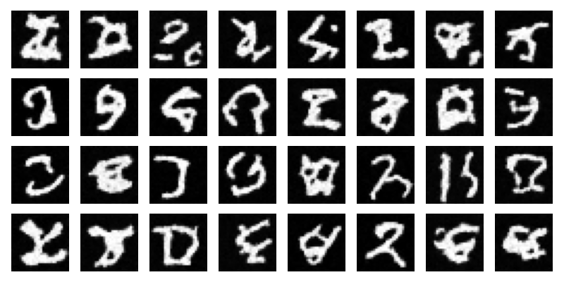
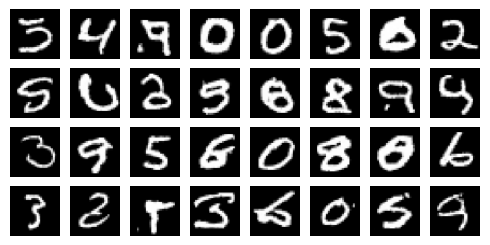
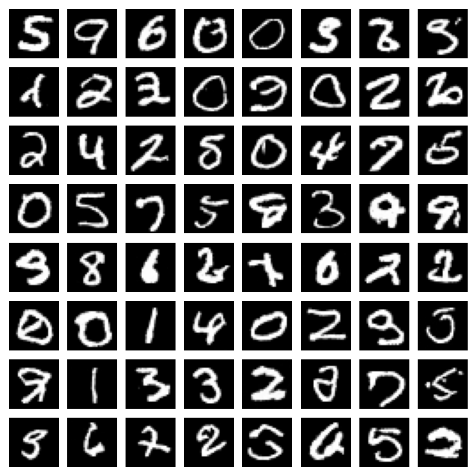
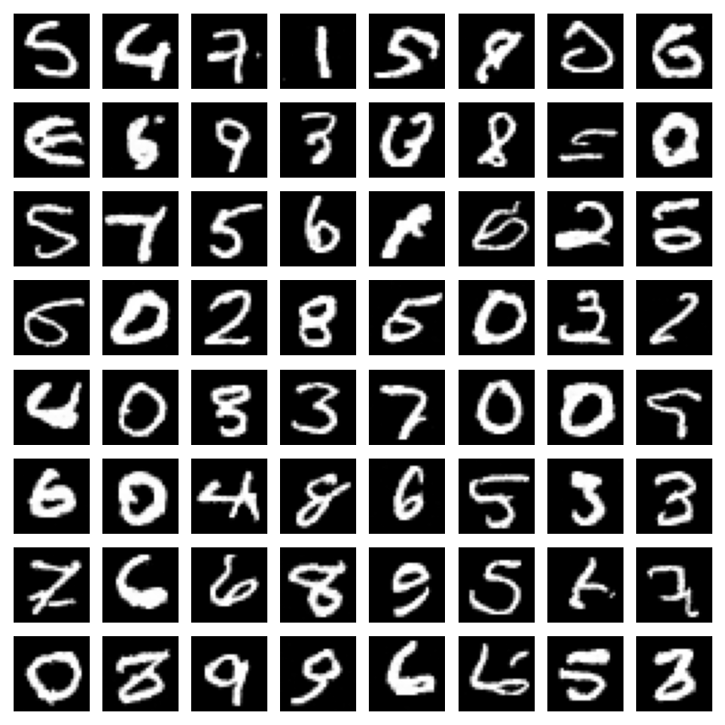
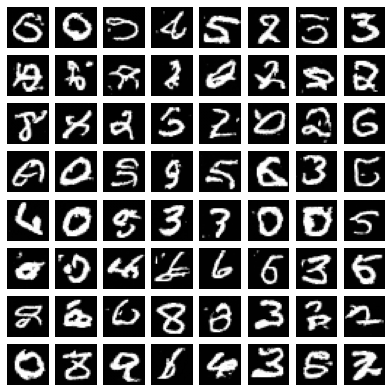
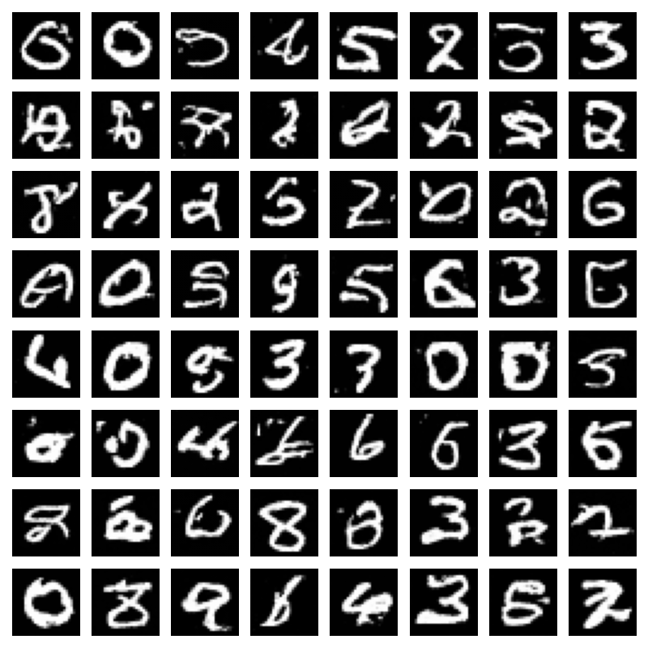

# Diffusion Model on MNIST

This project implements a Denoising Diffusion Probabilistic Model (DDPM) and an extended DDIM fast sampler to generate MNIST handwritten digits using PyTorch.

Diffusion models are state-of-the-art generative models and form the basis of modern systems such as Stable Diffusion.

---

## 📌 1. Project Goals

The goal of this project is to:

1. Implement the forward (noising) and reverse (denoising) processes of DDPM.

2. Train a UNet-based network to predict the noise at arbitrary timesteps.

3. Generate new MNIST digit samples starting from pure Gaussian noise.

4. Extend the baseline with DDIM fast sampling and compare speed/quality trade-offs.

5. Analyze how sampling steps affect generative performance.

---

## 📂 2. Dataset

We use the MNIST dataset:

- 60,000 training images (28×28 grayscale)
- Loaded automatically via `torchvision.datasets.MNIST`
- Only images are used (labels are ignored) because this is an **unconditional generative model**

Images are scaled from `[0, 1]` to `[-1, 1]` during preprocessing.

---

## ✅ 3. Method

### 3.1 Forward Process

Starting from a clean image $$\( x_0 \)$$, noise is gradually added according to:

$$
q(x_t \mid x_{t-1})
= \mathcal{N}(x_t;\, \sqrt{1-\beta_t}\, x_{t-1},\, \beta_t I)
$$

This can also be sampled in closed form from $$\( x_0 \)$$:

$$
x_t = \sqrt{\bar{\alpha}_t}\, x_0 \;+\; \sqrt{1 - \bar{\alpha}_t}\, \epsilon,
\qquad
\epsilon \sim \mathcal{N}(0, I)
$$

---

### 3.2 Reverse Process

The reverse process starts from pure noise and iteratively denoises the image:

$$
p_\theta(x_{t-1} \mid x_t)
$$

Instead of directly modeling this distribution, the model learns to **predict the noise**:

$$
L(\theta)
= \mathbb{E}\left[ \| \epsilon - \epsilon_\theta(x_t, t) \|_2^2 \right]
$$

This simple objective makes diffusion models stable and easy to train, compared to GANs.

---

### 3.3 Network Architecture

A small **U-Net-like architecture** is used, with:

- convolutional layers  
- residual blocks  
- timestep embeddings  
- skip connections between encoder and decoder

---

### 3.4 DDIM Sampling (Extension)

In addition to the standard DDPM reverse process, this project implements  
**Denoising Diffusion Implicit Models (DDIM)** (Song et al., 2020) to enable *fast sampling*.

DDIM redefines the reverse dynamics as a **deterministic mapping**, allowing sampling using only a
subset of timesteps (e.g., 20 or 50 steps instead of all 300).  
Importantly, the same trained noise-prediction model $$\( \epsilon_\theta \)$$ is reused—only the sampling
procedure changes.

Given the predicted noise, DDIM reconstructs an estimate of the original image:

$$
x_0^{\text{pred}}
= \frac{x_t - \sqrt{1-\bar{\alpha}_t}\,\epsilon_\theta(x_t,t)}
       {\sqrt{\bar{\alpha}_t}}
$$

Then the next sample $$\( x_{t'} \)$$ is computed deterministically:

$$
x_{t'}
= \sqrt{\bar{\alpha}_{t'}}\, x_0^{\text{pred}}
\;+\;
\sqrt{1-\bar{\alpha}_{t'}}\, \epsilon_\theta(x_t,t)
$$

This allows the model to generate coherent samples much faster, while still maintaining reasonable visual quality.

DDIM sampling is used later in the experiment section to compare 300-step DDPM sampling with 50-step
and 20-step DDIM sampling.

---

## 🧪 4. Experiments

### **Training Settings**

- **Timesteps:** 300  
- **Beta schedule:** linear  
```math
β_t ∈ [10^{-4}, 0.02]
```
- **Optimizer:** Adam (lr = 2e-4)  
- **Epochs:** 20 (adjustable)  
- **Batch size:** 128  
- **Loss:** MSE between predicted noise and true noise  

---

### **Checkpoints**
Trained model weights are saved at:
./checkpoints/model_latest.pth


---

### **Generated Samples**
Images produced during training are saved under:
./samples/


---

## 5. Results

### Training Samples (Epoch 1 → 20)

The following images show the progression of the model’s denoising ability during training.

#### Epoch 1 (initial reverse diffusion)


#### Epoch 20 (final training step)


### Final Generated Samples

After training for 20 epochs on MNIST, the diffusion model successfully generates clear and diverse handwritten digits from pure Gaussian noise.




---

## 🚀 6. DDIM Fast Sampling

In the original DDPM formulation, sampling requires running the reverse process for all diffusion steps (T = 300 in this project). This makes generation relatively slow on CPU.

To accelerate sampling, I additionally implemented Denoising Diffusion Implicit Models (DDIM) based on Song et al. (2020).  
DDIM treats the reverse process as a deterministic mapping and allows us to use a subsequence of timesteps instead of all 300 steps.

### 6.1 Implementation

- I added a new method `ddim_sample()` in the `Diffusion` class.
- Sampling now supports two modes:

  - **DDPM (baseline)**  
    ```bash
    python sample.py --checkpoint checkpoints/model_latest.pth --method ddpm
    ```
    Uses all 300 steps of the reverse process.

  - **DDIM (fast sampling)**  
    ```bash
    # 50-step DDIM
    python sample.py --checkpoint checkpoints/model_latest.pth --method ddim --num_steps 50

    # 20-step DDIM
    python sample.py --checkpoint checkpoints/model_latest.pth --method ddim --num_steps 20
    ```

  - The same trained model is reused; only the sampling process is changed.

### 6.2 Results

Below are example samples generated with different methods:

- **DDPM (300 steps)**  
  

- **DDIM (50 steps)**  
  

- **DDIM (20 steps)**  
  


### 6.3 Discussion

- DDIM reuses the same noise-prediction model ε_θ but changes the reverse dynamics.
- By using a deterministic update rule with a carefully chosen timestep subsequence, we can **trade off generation speed and image quality**.
- This experiment shows that diffusion models can generate high-quality MNIST digits with far fewer sampling steps than the original DDPM, which is especially important in resource-limited environments (like CPU-only training).

### 6.4 Analysis of DDIM Fast Sampling Results

Building on the visual samples shown above, we further analyze how reducing sampling steps affects 
the quality and structure of generated digits.

The qualitative differences are summarized below.

#### ✔ DDPM (300 steps)
- Full reverse diffusion process.
- Highest visual quality and stability.
- Serves as the baseline for comparison.

#### ✔ DDIM (50 steps)
- Sampling time is dramatically reduced (about **6× faster**).
- Digits remain sharp and well-formed.
- Visual quality is **nearly indistinguishable from DDPM**.
- Shows that most denoising refinement occurs in early timesteps.

#### ✔ DDIM (20 steps)
- Sampling is **15× faster** than DDPM.
- Digits are still recognizable and structurally valid.
- Some degradation appears:
  - Slight blurring
  - Occasional shape artifacts
  - Reduced detail in strokes
- Represents a good trade-off when real-time sampling is required.

#### ✔ Overall Insights
- DDIM demonstrates that **high-quality diffusion sampling does not require running every step**.
- Speed–quality trade-off:
  - 50-step DDIM ≈ DDPM quality  
  - 20-step DDIM = acceptable quality with huge speedup
- This confirms the theoretical result of Song et al. (2020):  
  *the reverse process can be made deterministic without harming sample consistency*.

These findings illustrate how DDIM can significantly accelerate generative sampling while preserving most of the model’s expressive power.


---

## ▶️ 7. How to Run

### 1) Install dependencies
```bash
pip install -r requirements.txt
```

### 2) Train the model (DDPM training)
```bash
python train.py
```
A trained model checkpoint will be saved at:
```bash
./checkpoints/model_latest.pth
```

### 3) Generate samples using DDPM (300-step baseline)
This performs the full reverse diffusion process.
```bash
python sample.py --checkpoint ./checkpoints/model_latest.pth --method ddpm --num_samples 64
```
The generated samples will be saved as:
```bash
./samples/generated_ddpm_full.png
```

### 4) Generate samples using DDIM (fast sampling)
50-step DDIM (good speed–quality balance)
```bash
python sample.py --checkpoint ./checkpoints/model_latest.pth --method ddim --num_steps 50 --num_samples 64
```
Output:
```bash
./samples/generated_ddim_50.png
```
20-step DDIM (very fast sampling)
```bash
python sample.py --checkpoint ./checkpoints/model_latest.pth --method ddim --num_steps 20 --num_samples 64
```
Output:
```bash
./samples/generated_ddim_20.png
```

#### Notes

DDPM always uses all 300 reverse steps.

DDIM allows sampling with far fewer steps (e.g., 50, 20), significantly reducing runtime.

Both methods reuse the same trained model; only the sampling strategy differs.


## 8. Conclusion

In this project, I implemented a Denoising Diffusion Probabilistic Model (DDPM) from scratch and trained it on the MNIST dataset. The model successfully learned the reverse diffusion process and generated clear, diverse handwritten digits from pure Gaussian noise.

Through the training progression, we observed:

- Early samples contained little recognizable structure.
- Mid–late epoch samples showed increasing denoising ability.
- Final DDPM samples were sharp, stable, and visually consistent.

Beyond reproducing the baseline DDPM, this project extended the model with **DDIM fast sampling**.  
By implementing DDIM and evaluating it at 50 and 20 sampling steps, I was able to empirically verify the **speed–quality trade-off** described in the DDIM paper:

- 50-step DDIM produced images nearly indistinguishable from full 300-step DDPM.
- 20-step DDIM generated recognizable digits at a fraction of the runtime, albeit with more artifacts.

This extension demonstrates that diffusion models can sample efficiently without relying on the full reverse process, and that deterministic DDIM dynamics retain much of the model’s generative ability.

Overall, this project deepened my understanding of:

- Forward and reverse diffusion processes  
- Noise prediction as a learning objective  
- The role of timestep schedules in generative quality  
- How alternative sampling strategies (like DDIM) impact runtime and output fidelity  

Future work may include experimenting with cosine or quadratic beta schedules, conditional diffusion models, higher-resolution datasets, or classifier-free guidance.  
Nevertheless, the results confirm that diffusion models — even in simple forms — are powerful and flexible generative frameworks.


